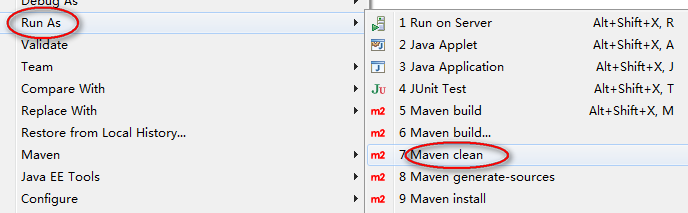
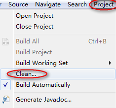
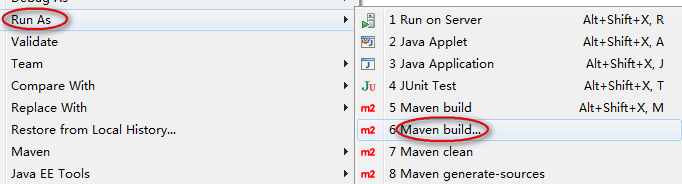
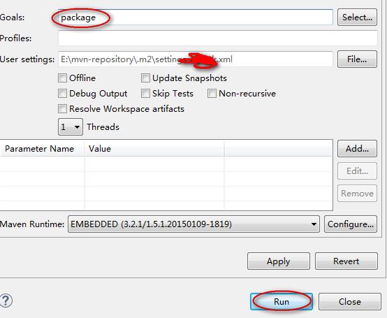
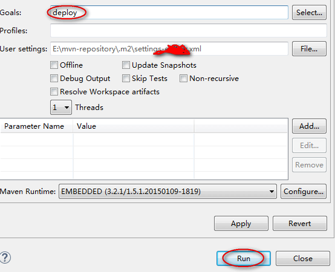

# Maven安装与配置

## Maven下载并安装

    $ wget http://mirrors.hust.edu.cn/apache/maven/maven-3/3.5.2/binaries/apache-maven-3.5.2-bin.tar.gz
    
    $ tar -zxvf apache-maven-3.5.2-bin.tar.gz && rm -rf apache-maven-3.5.2-bin.tar.gz
    
    $ mv apache-maven-3.5.2-bin apache-maven-3.5.2
    
    $ ln -s apache-maven-3.5.2 maven

## Maven配置

### 配置环境变量

    MAVEN_HOME=/usr/local/maven
    
    PATH=$PATH:$MAVEN_HOME/bin
    
    export MAVEN_HOME PATH

### 配置settings.xml

    $ vim $MAVEN_HOME/conf/settings.xml
    
1. 指定本地库目录。改变&lt;localRepository&gt;的值，如：

```xml
<localRepository>/opt/.m2/repository</localRepository>
```

2. 设置私服登录信息（使用私服时需配置）。可配置多个，被&lt;servers&gt;包围，如：

```xml
<server>
    <id>nexus</id>
    <username>admin</username>
    <password>admin123</password>
</server>
```

3. 设置私服镜像位置（使用私服时需配置），配置上后会在私服同步下载的包。可配置多个，被&lt;mirrors&gt;包围，如：

```xml
<mirror>
    <id>nexus</id>
    <mirrorOf>*</mirrorOf>
    <url>http://www.roonten.com:8081/nexus/content/groups/public</url>
</mirror>
```

# 私服搭建

[Nexus](https://github.com/aronideal/software-installation-guide/blob/master/guide/Nexus)

# 集成到Eclipse

## pom.xml配置

### 配置依赖包的引用。如：

```xml
<dependency>
    <groupId>commons-io</groupId>
    <artifactId>commons-io</artifactId>
    <version>2.2</version>
</dependency>
```

当使用本地依赖包时，需配置到pom.xml才可被Maven管理，以便打包或其它操作，使用&lt;systemPath&gt;标记表明jar包所在的本地位置。如：

```xml
<dependency>
    <groupId>com.test</groupId>
    <artifactId>mytool</artifactId>
    <version>1.0</version>
    <scope>system</scope>
    <systemPath>${project.basedir}/src/main/webapp/WEB-INF/lib/mytool-1.0.jar</systemPath>
</dependency>
```

### 试项目可deploy到私服。如：

```xml
<distributionManagement>
    <!-- Release版 -->
    <repository>
        <id>releases</id>
        <url>http://www.roonten.com:8081/nexus/content/repositories/releases</url>
    </repository>
    <!-- Snapshot版 -->
    <snapshotRepository>
        <id>snapshots</id>
        <url>http://www.roonten.com:8081/nexus/content/repositories/snapshots</url>
    </snapshotRepository>
</distributionManagement>
```

## 快速打包

### 1.clean，下图：



### 2.Eclipse Clean，下图：



### 3.输入Maven命令，下图：



### 4.打包，下图：



## 快速发布

### 1.clean，下图：


### 2.Eclipse Clean，下图：


### 3.输入Maven命令，下图：


### 4.发布，下图：



## 插件的使用

[Apache Maven 插件](https://github.com/aronideal/experience-sharing/blob/master/auickly/org.apache.maven.plugins.md)
